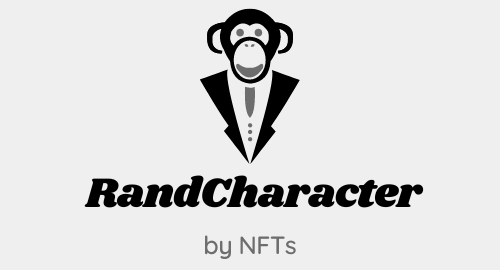
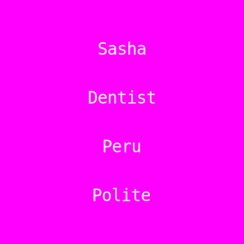
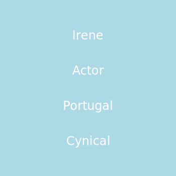
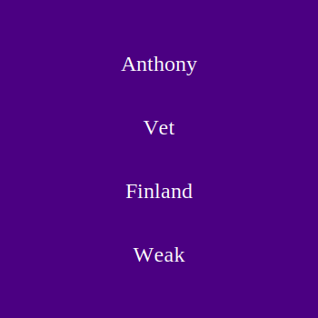

# RandCharacter

<!-- Badges -->
<p>
  <a href="https://github.com/diegotorreslopez81/Random-SVG-NFT/graphs/contributors">
    
  </a>
  <a href="">
    
  </a>
  <a href="https://github.com/diegotorreslopez81/Random-SVG-NFT/network/members">
    
  </a>
  <a href="https://github.com/diegotorreslopez81/Random-SVG-NFT/stargazers">
    
  </a>
  <a href="https://github.com/diegotorreslopez81/Random-SVG-NFT/issues/">
    
  </a>
  <a href="https://github.com/diegotorreslopez81/Random-SVG-NFT/blob/master/LICENSE">
    
  </a>
</p>



<h4>
    <a href="https://github.com/Louis3797/awesome-readme-template/">View Demo</a>
  <span> · </span>
    <a href="https://github.com/Louis3797/awesome-readme-template">Documentation</a>
  <span> · </span>
    <a href="https://github.com/Louis3797/awesome-readme-template/issues/">Report Bug</a>
  <span> · </span>
    <a href="https://github.com/Louis3797/awesome-readme-template/issues/">Request Feature</a>
  </h4>
</div>


Based on the idea of the Loot project, I want to build something similar, just creating a random character creation proof of concept. Here, the user just mints an NFT sending a seed word, and randomly, the Smart Contract generates an NFT with a Name, Profession, Country, and Personality, with different background color and font. In addition, the entries by default of every data can be modified.


[](https://www.youtube.com/watch?v=UyI6VuciJNg)


Some examples of RandCharacter NFTs:





## Prerequisites

- [Node.js](https://nodejs.org/en/download/)
- [MetaMask wallet browser extension](https://metamask.io/download.html).

## Getting Started

### Clone This Repo

Use `git clone git@github.com:diegotorreslopez81/Random-SVG-NFT.git` to get the files within this repository onto your local machine.

### Environment Setup

Duplicate `.env.example` to `.env` and fill out the `HARDHAT_CHAIN_ID` environment variable. The port from the example file, if it's free, will be fine in most cases.

Run `npm install`.

### Running The Smart Contract Locally

Compile the ABI for the smart contract using `npx hardhat compile`.

If you're successful, you'll recieve a confirmation message of:

```
Compilation finished successfully
```

And, a `src/artifacts` folder will be created in your project.

Deploy the smart contract to the local blockchain for testing with `npx hardhat node`.

If you're successful, you'll be presented with a number of account details in the CLI. Here's an example:

```
Account #0: 0xf39fd6e51aad88f6f4ce6ab8827279cfffb92266 (10000 ETH)
Private Key: 0xac0974bec39a17e36ba4a6b4d238ff944bacb478cbed5efcae784d7bf4f2ff80
```

Then in a new terminal window, `npx hardhat run scripts/deploy.js --network localhost`.

If you're successful, you'll get something like the following CLI output:

```
Minter deployed to: 0x9fE46736679d2D9a65F0992F2272dE9f3c7fa6e0
```

### Adding A Local Account To MetaMask

Open your MetaMask browser extension and change the network to `Localhost 8545`.

Next, import one of the accounts by adding its Private Key (for example, `0xac0974bec39a17e36ba4a6b4d238ff944bacb478cbed5efcae784d7bf4f2ff80` to MetaMask.

If you're successful, you should see the a balance resembling something like `10000 ETH` in the wallet.